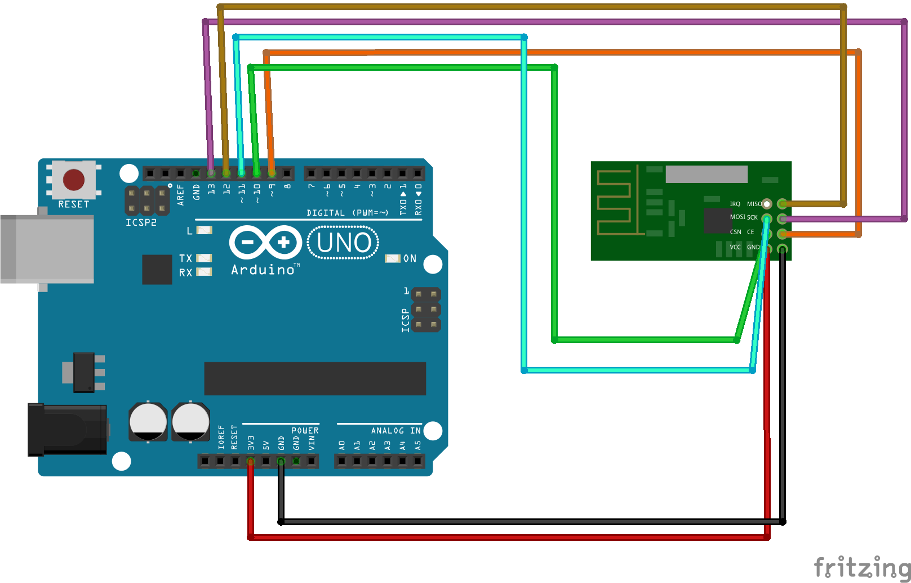

# 2.4GHz Channel Sweeper using NRF24

A lightweight Arduino-based **2.4GHz Channel Sweeper** designed for RF testing, interference analysis, and channel activity verification using the **nRF24L01** module.

---

## 🧠 Overview

This project cycles through all **2.4GHz ISM band channels (0–78)** and includes **BLE advertising channels (37, 38, 39)** while transmitting a constant carrier wave.  
Useful for lab environments, RF performance testing, or verifying signal presence on specific channels.

---

## ⚙️ Hardware Setup

| nRF24L01 Pin | Arduino Uno Pin | Notes |
|--------------|------------------|-------|
| VCC          | 3.3V             | Use stable 3.3V regulator; add 10uF–100uF decoupling capacitor if module unstable |
| GND          | GND              | Common ground required |
| CE           | D9               | Configurable in sketch (`PIN_RF24_CE`) |
| CSN          | D10              | Configurable in sketch (`PIN_RF24_CSN`) |
| SCK          | D13              | SPI SCK |
| MOSI         | D11              | SPI MOSI |
| MISO         | D12              | SPI MISO |
| IRQ          | (optional)       | Not used by this sketch |

---

## 🧩 Software Requirements

- **Arduino IDE** (v1.8.5 or newer)
- **RF24 Library** by TMRh20  
  → [https://github.com/tmrh20/RF24](https://github.com/tmrh20/RF24)

### Installation (RF24 Library)
1. Open Arduino IDE  
2. Go to `Sketch → Include Library → Manage Libraries...`  
3. Search for **RF24** and install **by TMRh20**

---

## 🧰 Sketch Diagram

---

## 🚀 Usage

1. Connect your **nRF24L01** module as per the table above.  
2. Open `.ino` in Arduino IDE.  
3. Select **Arduino Uno** board and correct **COM port**.  
4. Upload the sketch.  
5. Open **Serial Monitor** at `115200 baud` to view status logs.

---

## 📡 Technical Details

- Frequency Band: 2.400 GHz – 2.4835 GHz  
- Total Channels: 79  
- BLE Channels Covered: 37 (2402 MHz), 38 (2426 MHz), 39 (2480 MHz)  
- Data Rate: 2 Mbps  
- Power Level: Maximum (`RF24_PA_MAX`)  
- Mode: Constant carrier transmit  

---

## Related Course

Take your skills to the next level with **Bluetooth Hacking and Security MasterClass**, a hands-on, lab-driven Udemy course tailored for red-teamers, penetration testers, security researchers, and hardware security enthusiasts.

**Course title:** Bluetooth Hacking and Security MasterClass  
**Description:** Master practical Bluetooth offensive and defensive skills with this hands-on, lab-driven course designed for red-teamers, penetration testers, security researchers, and hardware security enthusiasts. You’ll move from clear foundational theory into realistic, mission-oriented exercises that mirror real engagement workflows: recon → weaponized → execute → document → remediate.

---
### 3. **Bluetooth Hacking & Security MasterClass**

Resolve common issues with this helpful troubleshooting video:  

---
## ⚠️ Disclaimer

This project is intended **strictly for educational and laboratory use**.  
Unauthorized transmission or interference with public communication channels may violate local telecommunication regulations.

- Use only in **controlled RF environments** (e.g., shielded rooms, test enclosures).  
- The authors and contributors are **not responsible for misuse** or illegal application of this code.  
- Always ensure compliance with your **country’s RF transmission laws**.

---

## ⚙️ Notes

- Perform testing at **low output power** when possible.  
- Ensure proper decoupling capacitor near the nRF24L01 module for stable operation.  
- The sketch utilizes **recursive channel sweeping** for smoother frequency transitions.

---

## 📄 License

This project is released under the **MIT License**.  
See [LICENSE](./LICENSE) for details.

